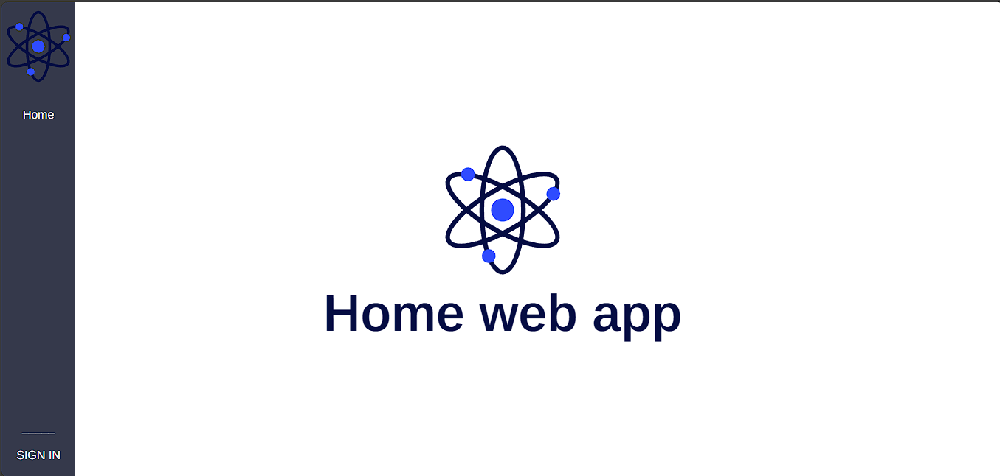

#SISTEMA DE PLANIFICACIÓN DE RECURSOS EMPRESARIALES SOBRE GESTIÓN Y PERMISOS DE USUARIO DENTRO DE LA INTERFAZ

- Framework Python (Django + Django Rest Framework(DRF))
- Modelo de Base de Datos con PostgresSQL y ORM models (QuerySets) de Django
- Frontend HTML5, CSS, Javascript y ReactJS
- Seguridad implementada, rastreo por dirección IP, Autenticatión y Permisos con simpleJWT, generador de códigos aleatorios para controlar perspectiva y privilegios del usuario.

> El sistema de base de datos tiene cuatro modelos, *Módulos*,*Agentes*,*Usuarios* y *Códigos Libres*  que deberían de funcionar:
  
- ***Módulos:*** es una tabla que se encarga de mantener un **grupo asginado** a cada uno de los agentes. Éste grupo permite aislar las dos propiedades específicas de Staff y Super User de Django y hace controlar los cuatro estados de datos (editar, crear o enviar, recibir y eliminar) independientemente de su relación (staff o super user).
- ***Agentes:*** es encargada de recibir varias **utilidades** importante y dos relaciones (User y Módulos). Con él se verifica la dirección de IP para programar las sesiones y el comportamiento directo con la API a través de la columna **current_ip**.
  
    - Contiene un **Secret Key** que se le asigna específicamente para poder asignarle un cambio hacia un nuevo rol como **super usuario**.
    - El módulo asignado lo hace cambiar rápidamente de sus permisos para ***cambiar algo con el ERP***.
- ***Códigos Libres***: son asignados para cambiar varias percpectivas con el usuario (privilegios y seguridad por eventos).
- ***Usuarios***: mantiene la estructura principal de los usuarios en conjunto con el modelo ***Agentes***.

Tiene Asignado SimpleJWT y una tabla de lista negra para gestionar los Token que se le son asignados a cada Agente dentro del ERP.

